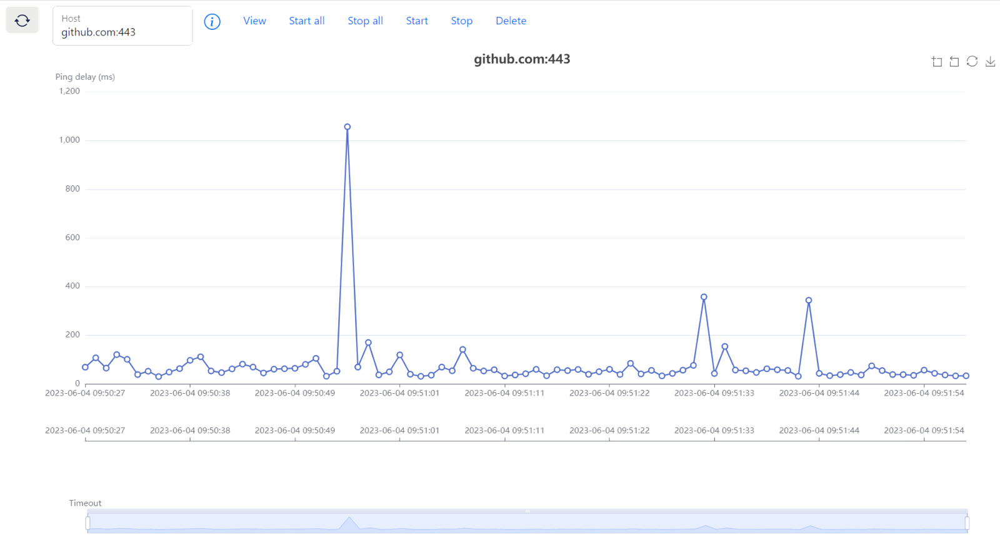

# Parallel tcping visualization
 Perform "tcping" in parallel and visualize in the dashboard




## Usage

**Source code:**

1. Set the project root as the current folder in terminal. 

2. Activate Python virtual environment if applicable.

3. Run the following script. 

   ```bash
   pip install -r requirements.txt
   python -m flask run 
   ```

It occupies localhost 5000 port by default.

- [Customize host of Flask application](https://flask.palletsprojects.com/en/2.3.x/quickstart/)
- [Customize port of Flask application](https://flask.palletsprojects.com/en/2.3.x/server/#address-already-in-use)

**Release:**

1. Download and unzip the release.
1. Open `parallel_ping_visualization.exe`.

**Use:**

1. Choose one existed or create a new table to store TCPing records.

- Leave blank and submit: Close the current task. It will stop performing TCPing to all hosts.
- Input a new name: Create a new task. It should be a valid name of the SQLite3 table.
- Clear text and select an existed name: View the records of an existed task. All existed tasks are listed in the dropdown.

2. Refer to the following functions.

| Function | Description |
| --------- | ------------------------------------------------------------ |
| View      | In the host box: Input a new host (domain) or clear text and select an existed host. It shows all TCPing records of this host in the chart. |
| Start all | It performs TCPing to all these hosts in parallel. *To add a host into list, input or select it and click "view". The dropdown shows all hosts in the list.* |
| Stop all  | It stops TCPing to all hosts listed. *The dropdown shows all hosts in the list.* |
| Start     | It continuously perform TCPing to the host in the box.       |
| Stop      | It stops TCPing to the host in the box.                      |
| Delete    | It deletes the host in the box along with related TCPing records. |
